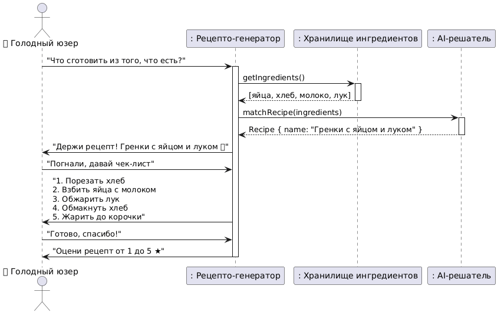

<p align="center">Министерство образования Республики Беларусь</p>
<p align="center">Учреждение образования</p>
<p align="center">"Брестский Государственный технический университет"</p>
<p align="center">Кафедра ИИТ</p>
<br><br><br><br><br><br>
<p align="center"><strong>Лабораторная работа №1</strong></p>
<p align="center"><strong>По дисциплине:</strong> "Проектирование интернет-систем"</p>
<p align="center"><strong>Тема:</strong> "Сценарий транзакции: моделирование use-case и границ ответственности"</p>
<br><br><br><br><br><br>
<p align="right"><strong>Выполнила:</strong></p>
<p align="right">Студентка 3 курса</p>
<p align="right">Группы ПО-12</p>
<p align="right">Езерская О.Г.</p>
<p align="right"><strong>Проверил:</strong></p>
<p align="right">Шорох Д.В.</p>
<br><br><br><br><br>
<p align="center"><strong>Брест 2026</strong></p>

---

## Цель работы

Научиться анализировать бизнес-процессы интернет-системы, выявлять границы ответственности компонентов и моделировать транзакционные сценарии с учётом возможных сбоев.

---

## Вариант №25 - Рецепто-генератор «Из того, что есть» 🥗

**Питч:** Кухня без похода в магазин.

**Ядро домена:** Ингредиенты на складе, Подбор рецептов, Чек-лист готовки.

---

## Ход выполнения работы

### 1. Структура проекта

---
lab1/
├── Отчёт.md               # Основной отчёт (этот документ)
├── use-case.md             # Текстовое описание use-case
├── diagrams/
│   ├── sequence-happy.puml # PlantUML для успешного сценария
│   ├── sequence-happy.png  # Экспорт диаграммы
│   ├── sequence-error-payment.puml
│   └── sequence-error-payment.png
├── scenarios.feature       # Gherkin-сценарии
└── analysis.md             # Анализ границ ответственности
---


---

### 2. Use-case описание

👉 **Ссылка на файл:** [use-case.md](use-case.md)

**Основной сценарий:** Генерация рецепта из имеющихся ингредиентов

**Первичный актор:** Голодный пользователь

**Цель:** Получить пошаговый рецепт приготовления блюда из тех ингредиентов, которые уже есть в холодильнике, без похода в магазин

**Краткое описание основного потока:**
1. Пользователь открывает раздел "Рецепто-генератор" в приложении
2. Система отображает текущий список ингредиентов из холодильника
3. Пользователь нажимает кнопку "Что приготовить из того, что есть?"
4. Система проверяет каждый ингредиент на просрочку
5. Система отправляет запрос к AI-сервису на генерацию рецепта
6. AI-сервис возвращает рецепт (название, ингредиенты, пошаговую инструкцию)
7. Система сохраняет сгенерированный рецепт в историю пользователя
8. Система создаёт чек-лист готовки с таймерами на каждый шаг
9. Система отображает пользователю рецепт с пошаговой инструкцией
10. Пользователь видит уведомление "Приятного аппетита! 🍳"

**Альтернативные потоки:**
- Добавление ингредиентов вручную (при пустом холодильнике)
- Замена ингредиента на лету ("Ой, нет соли")
- AI-сервис не отвечает (использование кэша топ-5 рецептов)

**Исключительные ситуации:**
- Ошибка валидации данных (пустой список ингредиентов, более 20 ингредиентов)
- Просроченный ингредиент в холодильнике
- Превышение лимита запросов (10 рецептов за час)
- Таймаут при запросе к AI-сервису
- Ошибка сохранения в базу данных
- Недоступность сервиса уведомлений (очередь RabbitMQ)

---

### 3. Диаграммы последовательности (Sequence Diagrams)

#### 3.1. Happy Path (успешный сценарий)

👉 **PlantUML исходник:** [diagrams/sequence-happy.puml](diagrams/sequence-happy.puml)



**Описание потока:**
1. Пользователь нажимает "Что приготовить из того, что есть?"
2. Recipe Service проверяет ингредиенты на просрочку
3. Recipe Service отправляет запрос к AI-сервису
4. AI возвращает сгенерированный рецепт
5. В транзакции БД сохраняется рецепт в историю пользователя
6. В очередь RabbitMQ публикуется задача на отправку push-уведомлений (таймеры готовки)
7. Пользователь получает готовый рецепт и пошаговый чек-лист

**Участники:**
- Голодный пользователь (актор)
- Web UI
- Recipe Service
- Freshness Service (проверка просрочки)
- AI Service (генератор рецептов)
- PostgreSQL (БД истории рецептов)
- RabbitMQ (очередь уведомлений)
- Notification Service

#### 3.2. Error Case (сценарий с ошибкой)

👉 **PlantUML исходник:** [diagrams/sequence-error.puml](diagrams/sequence-error.puml)


**Описание потока:**
- При попытке запросить AI-сервис происходит таймаут (более 3 секунд)
- Система выполняет повторные попытки (2 раза с задержкой 1с, 2с)
- После повторных таймаутов система переключается на кэш топ-5 базовых рецептов
- Рецепт из кэша сохраняется в историю с пометкой "source: fallback_cache"
- Пользователь получает сообщение: "AI сейчас занят, держи классический рецепт"
- Транзакция БД фиксируется (рецепт сохранён)

---

### 4. Gherkin-сценарии

👉 **Ссылка на файл:** [scenarios.feature](scenarios.feature)

**Реализовано сценариев:** 7

**Список сценариев:**
1. ✅ **Успешный сценарий** — генерация рецепта с чек-листом готовки
2. ✅ **Ошибка:** пустой список ингредиентов (ошибка валидации)
3. ✅ **Ошибка:** превышение максимального количества ингредиентов (более 20)
4. ✅ **Ошибка:** AI-сервис недоступен (таймаут)
5. ✅ **Ошибка:** превышение лимита запросов (10 рецептов за час)
6. ✅ **Альтернатива:** просроченный ингредиент в холодильнике
7. ✅ **Альтернатива:** очередь уведомлений недоступна (outbox)

**Пример сценария:**
```gherkin
Функция: Генерация рецепта из имеющихся ингредиентов в кулинарном помощнике

  Сценарий: Успешная генерация рецепта с чек-листом готовки
    Когда пользователь нажимает "Что приготовить из того, что есть?"
    И система проверяет ингредиенты на просрочку
    И AI-сервис генерирует рецепт "Гренки с яйцом и луком"
    Тогда система сохраняет рецепт в историю пользователя
    И система создаёт задачу для показа пошагового чек-листа
    И пользователь видит рецепт с ингредиентами и инструкцией
    И пользователь видит уведомление "Приятного аппетита! 🍳"
```

---

### 5. Анализ границ ответственности

👉 **Ссылка на файл:** [analysis.md](analysis.md)

#### 5.1. Транзакционные границы

| Операция | Синхронная/Асинхронная | Откат при ошибке | Retry-стратегия | Идемпотентность |
|----------|------------------------|------------------|-----------------|-----------------|
| Валидация данных (ингредиенты не пустые, не более 20) | Синхронная | Да (остановка потока) | Нет | Нет |
| Проверка просрочки ингредиентов | Синхронная | Да (ROLLBACK) | Нет | Да (по списку ингредиентов) |
| Запрос к AI-сервису на генерацию рецепта | Синхронная | Да (fallback на кэш) | 2 попытки с exp. backoff (1с, 2с) | Да (хэш списка ингредиентов) |
| Сохранение рецепта в историю (БД) | Синхронная | Да (ROLLBACK) | Нет | Да (по request_id) |
| Проверка лимита запросов (10/час) | Синхронная | Да (отказ HTTP 429) | Нет | Да (user_id + временное окно) |
| Отправка push-уведомлений (таймеры готовки) | Асинхронная | Нет (best-effort) | 3 попытки → DLQ | Да (recipe_id + step_number) |
| Сохранение оценки пользователя (лайк/дизлайк) | Асинхронная | Нет | 5 попыток | Да (user_id + recipe_id) |

#### 5.2. Обработка исключительных ситуаций

**Реализовано стратегий обработки:** 4

**Примеры:**

##### Исключительная ситуация 1: Таймаут при запросе к AI-сервису

- **Условие возникновения:** Внешний AI-сервис не отвечает в течение 3 секунд
- **Обнаружение:** HTTP-клиент выбрасывает TimeoutException, система логирует ошибку "AI service timeout for ingredients"
- **Реакция:** Система не сохраняет рецепт в историю, прерывает транзакцию, выполняет 2 повторные попытки, при повторном таймауте переключается на кэш топ-5 базовых рецептов
- **Компенсация:** Фоновый шедулер раз в 5 минут проверяет доступность AI и восстанавливает кэш
- **Уведомление пользователя:** "AI сейчас занят, держи классический рецепт из нашего сборника"

##### Исключительная ситуация 2: Ошибка подключения к очереди сообщений (RabbitMQ)

- **Условие возникновения:** После сохранения рецепта в БД RabbitMQ недоступен
- **Обнаружение:** AmqpException при вызове rabbitTemplate.convertAndSend()
- **Реакция:** Система логирует ошибку, сохраняет задачу в таблицу outbox со статусом PENDING
- **Компенсация:** Фоновый scheduler сканирует outbox и повторяет отправку каждые 30 секунд, после успеха статус меняется на SENT
- **Уведомление пользователя:** Пользователь видит "Рецепт успешно сгенерирован", администратор получает алерт о падении очереди

##### Исключительная ситуация 3: Просроченный ингредиент в холодильнике

- **Условие возникновения:** В списке ингредиентов есть продукт с датой годности < текущей даты
- **Обнаружение:** Сервис FreshnessService запрашивает БД сроков годности, находит ингредиент со статусом EXPIRED
- **Реакция:** Система удаляет просроченный ингредиент из списка, добавляет предупреждение, генерирует рецепт на оставшихся ингредиентах
- **Компенсация:** Если после удаления просрочки осталось 0 ингредиентов → совет «Сходи в магазин»
- **Уведомление пользователя:** Красное предупреждение: "Яйца просрочены на 3 дня, не рискуй! Они не будут использованы в рецепте"

##### Исключительная ситуация 4: Превышение лимита запросов (10 рецептов за час)

- **Условие возникновения:** Пользователь отправил 11-й запрос на генерацию рецепта в течение часа
- **Обнаружение:** Система проверяет счётчик запросов по user_id в Redis, счётчик показывает 10
- **Реакция:** Система не начинает транзакцию генерации рецепта, возвращает HTTP 429 с заголовком Retry-After: 3600
- **Компенсация:** Счётчик автоматически обнуляется через час (TTL в Redis)
- **Уведомление пользователя:** "Ты уже сгенерировал 10 рецептов за час. Отдохни, кухня остывает. Вернись через X минут"

---

## Контрольные вопросы

**Подготовка к защите:**

1. **Что такое транзакционная граница? Где она проходит в вашем сценарии?**
   - Транзакционная граница — это область операций, которые должны быть выполнены атомарно (всё или ничего). В моём сценарии транзакционная граница проходит от получения запроса на генерацию рецепта до фиксации рецепта в базе данных истории. Проверка просрочки, запрос к AI и сохранение результата происходят в одной транзакции.

2. **Почему операция X выбрана синхронной, а Y - асинхронной?**
   - Сохранение в БД и запрос к AI — синхронные операции, потому что пользователь должен сразу получить рецепт. Отправка push-уведомлений — асинхронная, так как она не влияет на факт получения рецепта, может выполняться долго, и её временная недоступность не должна блокировать пользователя.

3. **Как обеспечить идемпотентность при повторных запросах?**
   - Идемпотентность обеспечивается использованием уникального идентификатора запроса (idempotency key), который передаётся клиентом. Сервер проверяет наличие этого ключа в кэше Redis. Если операция с таким ключом уже выполнялась, возвращается ранее сохранённый результат без повторного выполнения. Для запросов к AI используется хэш списка ингредиентов.

4. **Что произойдёт, если внешний сервис вернёт ошибку после частичного выполнения операции?**
   - Если ошибка произошла после сохранения рецепта в БД, но до отправки уведомлений (RabbitMQ недоступен), задача сохраняется в таблицу outbox. Фоновый процесс позже повторит попытку. Если ошибка произошла во время запроса к AI, транзакция БД откатывается, и рецепт не сохраняется (пользователь получает fallback из кэша).

5. **Как система обнаружит, что внешний сервис недоступен?**
   - Система использует механизмы: таймауты HTTP-клиентов (3 секунды для AI, 5 секунд для файлового сервиса), проверку health-эндоинтов сервисов (health checks каждые 30 секунд), обработку исключений (TimeoutException, ConnectException), а также circuit breaker (Resilience4J) для предотвращения каскадных отказов.

6. **Какие данные нужно логировать для диагностики сбоев?**
   - correlationId (уникальный идентификатор запроса), timestamp (время события), user_id (идентификатор пользователя), operation (название операции: validate, ai_request, save_to_db), error_message (текст ошибки), stack_trace (трассировка), request_payload (тело запроса для воспроизведения), response_status (код ответа), duration_ms (время выполнения).

---

## Ссылка на репозиторий

👉 **GitHub:** [https://github.com/ezerskaya/recipe-generator-lab1](https://github.com/ezerskaya/recipe-generator-lab1)

---

## Вывод

В ходе выполнения лабораторной работы был проанализирован бизнес-процесс "Генерация рецепта из имеющихся ингредиентов" для интернет-системы "Рецепто-генератор «Из того, что есть»".

#### Что было сделано:
- Разработано текстовое описание use-case с выделением основного потока, альтернатив и исключительных ситуаций
- Построена use-case диаграмма с молодежным подходом к описанию
- Построены диаграммы последовательности (sequence diagrams) с использованием PlantUML для визуализации взаимодействия компонентов в успешном сценарии и сценарии с ошибкой
- Созданы Gherkin-сценарии для BDD-тестирования (7 сценариев: 1 успешный, 4 ошибочных, 2 альтернативных)
- Выполнен анализ транзакционных границ с определением синхронных и асинхронных операций
- Описаны стратегии обработки исключительных ситуаций (таймаут AI-сервиса, недоступность очереди сообщений, просроченные ингредиенты, лимит запросов)

#### Освоенные навыки:
- Моделирование бизнес-процессов с помощью use-case
- Построение UML-диаграмм в формате PlantUML
- Написание BDD-сценариев на Gherkin
- Анализ границ ответственности в распределённых системах
- Проектирование стратегий отказоустойчивости (retry, fallback, компенсация, idempotency, outbox pattern)

#### Использованные инструменты:
- PlantUML — создание диаграмм последовательности и use-case
- Gherkin (Cucumber) — написание сценариев тестирования
- Markdown — оформление документации
- VS Code — редактор с расширениями для PlantUML и Cucumber

#### Сложности:
- Правильное отображение асинхронных операций на диаграммах последовательности
- Выбор между синхронной и асинхронной обработкой для различных операций
- Проектирование компенсирующих действий при частичных отказах (outbox-паттерн)
- Определение границ транзакции при наличии внешних вызовов (AI-сервис)

В результате работы сформировано понимание ключевых принципов проектирования транзакционных сценариев в интернет-системах, что является основой для последующей реализации backend-части на Spring Boot.

---

**Дата выполнения:** 23.04.2026

**Оценка:** _____________

**Подпись преподавателя:** _____________
